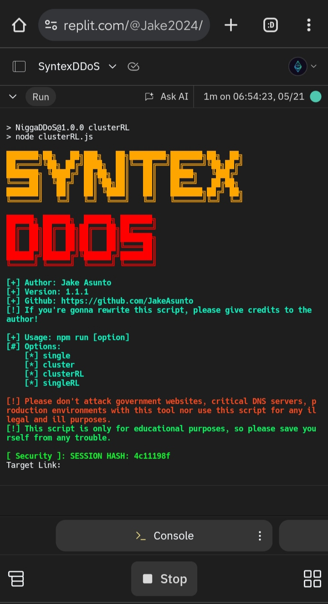

> ## **SyntexDDoS** 🎯

* This tool is developed for educational purposes and `is capable of dealing damage in larger server resources but it's authors have no real world intent for any harm/damage. 🏵️`
* **The author is not responsible for any damage this tool may cause on servers. ( e.g Servers not responding, Servers shutting down, Servers temporarily unable to serve requests, Servers getting downtime due to lack of adequate server resources or it's resources we're simply exhausted and overwhelmed. )**

> Single Readline Method in Replit. (May 21, 2024) 6AM GMT +8</img>

> ## Install Dependencies
- Dependencies: crypto, fs, fetch, axios, figlet, chalk@4.1.2
  
* `crypto, fs & node-fetch are built-in APIs in Node.js`
```bash
npm install --save axios figlet chalk@4.1.2
```

- ### How to Use?
> **Type the following command in your shell:**
```bash
# Default: npm run singleRL

npm run [option]

# [+] Options:
  # [*] cluster
  # [*] clusterRL
  # [*] singleRL
  # [*] single

# FOR EXAMPLE:
# npm run cluster

# Friendly Reminder: PLEASE USE YOUR BRAIN 🧠 
```
